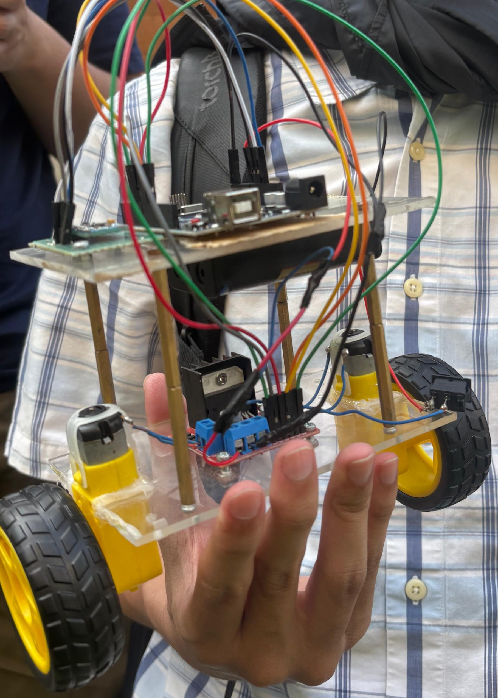
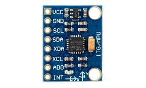
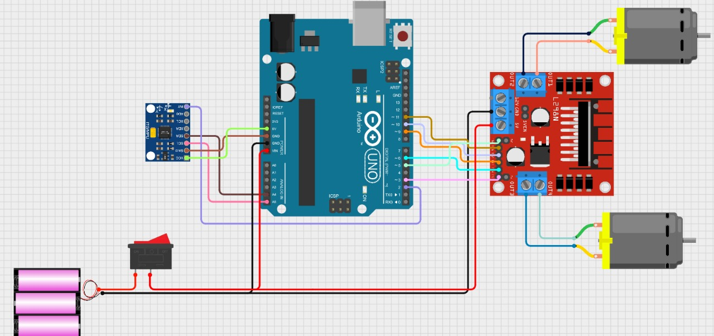
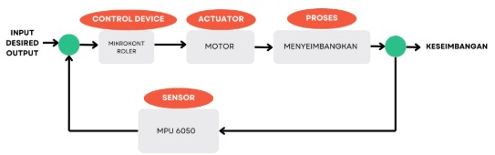

# 🤖 Self-Balancing Robot with PID Control

A self-balancing two-wheeled robot using **MPU6050** IMU and **PID control**, powered by an **Arduino UNO**. This robot maintains its upright position using closed-loop feedback from the MPU6050 sensor and dynamically adjusts motor output.

---

## 🎯 Project Goals

- Implement a **self-balancing robot** using Arduino.
- Use the **MPU6050** sensor in DMP mode to obtain accurate orientation.
- Apply **PID control** for real-time balancing.
- Test and tune PID using **Ziegler-Nichols** and **brute-force** methods.
- Provide clear documentation with wiring diagrams, data plots, and evaluation.

---

## ⚙️ Control System & PID Tuning

### 🌀 Loop Control System

The control loop runs every **10 ms** and performs the following steps:

1. **Read Angle** from MPU6050 (DMP output - roll).
2. **Calculate Error** from the setpoint (target angle = 0°).
3. **Apply PID** algorithm to determine motor power.
4. **Send PWM Signal** to motor driver (L298N / L9110S).
5. **Failsafe**: Stop motors if angle exceeds ±45° to prevent falling.

---

### 🧪 PID Tuning Methods

Two methods were used to tune the PID gains:

#### 1. 🔧 Ziegler–Nichols Method

- Increase `Kp` until the robot oscillates at a constant amplitude.
- Record the **ultimate gain (Ku)** and **oscillation period (Tu)**.
- Apply Ziegler–Nichols formulas to calculate `Kp`, `Ki`, and `Kd`.

| Parameter | Value |
|----------|-------|
| Ku       | _e.g., 35_ |
| Tu       | _e.g., 0.4 s_ |

**PID Constants** (for classic Z-N tuning):

- `Kp = 0.6 * Ku`
- `Ki = 2 * Kp / Tu`
- `Kd = Kp * Tu / 8`

#### 2. 🧠 Brute-Force Manual Tuning

- Manually adjust `Kp`, `Ki`, `Kd` by observing behavior:
  - Increase `Kp` until it balances but oscillates.
  - Add `Kd` to dampen oscillation.
  - Fine-tune `Ki` to correct steady-state error.

---

## 🧭 Sensor: MPU6050

The **MPU6050** provides real-time orientation using gyroscope and accelerometer fusion.

- Operated in **DMP mode** for better accuracy.
- Connected via **I2C** to Arduino.

### 📌 Wiring MPU6050

| MPU6050 Pin | Arduino UNO |
|-------------|-------------|
| VCC         | 3.3V / 5V   |
| GND         | GND         |
| SDA         | A4          |
| SCL         | A5          |

---

## ⚙️ Motor Driver (L298N)

Used to control **two DC motors** independently with PWM signals.

### L298N Wiring 

| Function     | Arduino UNO |
|--------------|-------------|
| Enable A     | D5          |
| IN1 / IN3    | D6 / D8     |
| IN2 / IN4    | D7 / D9     |
| Enable B     | D10         |

### Power

- Motor VCC: 6–12V (external supply)
- Logic VCC: 5V from Arduino
- GNDs must be connected together

---

## 🧰 Wiring Diagram

> Ensure strong power and signal wiring for motors and sensors. Use capacitors and ferrite beads if needed to reduce noise.

---

## 🔄 Closed-Loop Control Diagram

This system uses feedback from the MPU6050 to adjust the motor output through the PID controller, achieving real-time balancing.

---

## ▶️ Demo & Evaluation

### 🚀 How to Run

1. Upload the Arduino code via IDE.
2. Power the robot and place it on a flat surface.
3. Open Serial Monitor (`115200 baud`) to observe angle data.
4. Push gently to test recovery and stability.

### ✅ Performance Tests

- **Recovery Speed** after external disturbances
- **Angle Oscillation** range near balance
- **Failsafe** triggers beyond ±45°
- **PID Stability** during motion

[🎥 Watch Demo Video]([https://youtu.be/your_demo_link](https://youtube.com/shorts/IcyV9gzD1IM?si=FrDT6r6DSqdANZvg))

---

## ✅ Conclusion

This project successfully demonstrates a self-balancing robot using **PID control** and **MPU6050 IMU**. The integration of DMP mode and loop tuning enables reliable, responsive balancing. It can serve as a base for mobile robotics research, embedded system learning, or control system education.

---

## 👥 Team Members

- **Dos Hansel Sihombing** – 235150301111001  
- **Adika Rizky Primantoro** – 235150301111011
- **Muhammad Raka Naufal** – 235150307111004
- **Muhammad Syauqi Fadillah** – 235150307111007
- **Daffa Fawwaz Garibaldi** – 235150307111011
- **Khalisa Nur Safira** – 235150307111012

---

